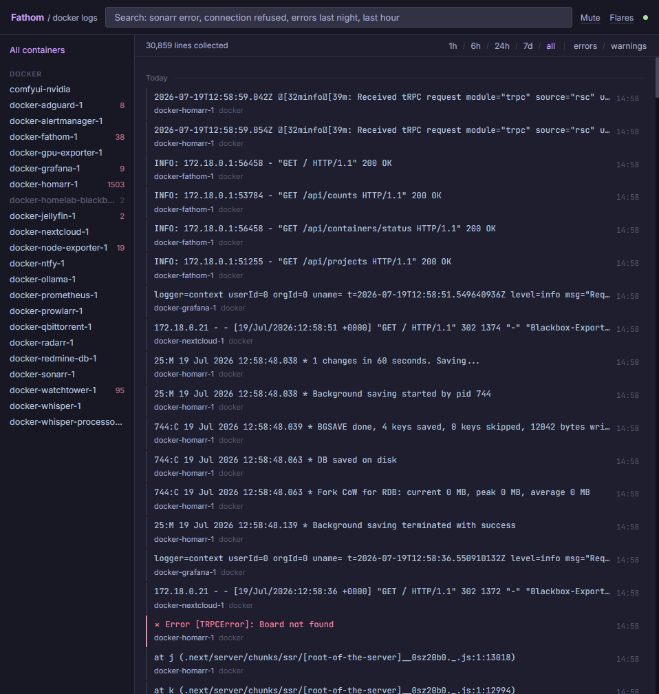

# Fathom

**Fathom what's happening in your stack.**

[](https://github.com/anejckl/fathom/pkgs/container/fathom)
[](LICENSE)

Fathom is a persistent Docker log aggregator built for homelabs. It fills the gap between Dozzle (real-time only, no history) and Loki (full stack, heavy). One container. Zero config. Search logs from last night in plain English.



---

## Features

- **Zero config** — auto-discovers every container via Docker socket, no labels or env vars required
- **Persistent** — logs survive container restarts and are searchable days later
- **Live stream** — new lines appear instantly via SSE, no polling
- **NL search** — ask in plain English: `errors last night`, `sonarr warnings`, `critical last hour`
- **FTS5 + stemming** — `fail` finds `failed`, `failure`, `failing`; prefix matching included
- **Noise filters** — suppress health check spam at ingest time, before it hits the DB
- **Webhook alerts** — get notified on ntfy, Discord, or Slack when errors spike
- **Compose grouping** — sidebar groups containers by Docker Compose project
- **Log context** — click any line to see the 20 lines around it
- **Retention** — configurable auto-cleanup of old logs (default: 30 days)
- **Lightweight** — single container, ~50MB RAM, SQLite storage

---

## Quick start

```yaml
services:
  fathom:
    image: ghcr.io/anejckl/fathom:latest
    container_name: fathom
    restart: unless-stopped
    ports:
      - "8000:8000"
    environment:
      - RETENTION_DAYS=30
      - TZ=Europe/London
      # Optional: enable NL search via local Ollama
      # - OLLAMA_URL=http://ollama:11434
      # - OLLAMA_MODEL=llama3.2:latest
    volumes:
      - /var/run/docker.sock:/var/run/docker.sock:ro
      - fathom-data:/data

volumes:
  fathom-data:
```

Open `http://localhost:8000`.

---

## NL search examples

Fathom's built-in parser handles common queries instantly — no Ollama required:

| Query | What it does |
|-------|-------------|
| `errors today` | All error-level logs in the last 24h |
| `sonarr warnings` | Warnings from docker-sonarr-1 only |
| `critical last night` | Errors from the last 16h |
| `radarr last hour` | All radarr logs in the last 60 minutes |
| `warn yesterday` | Warnings from the last 48h |
| `last 5 minutes` | Everything in the last 5 minutes |
| `connection refused` | FTS keyword search with stemming |

Container shortnames are resolved automatically — type `sonarr` and Fathom maps it to `docker-sonarr-1`.

Level aliases: `critical`, `crit`, `fatal` → error · `warn` → warning

With `OLLAMA_URL` set, more complex free-form queries fall through to your local LLM.

---

## Without Ollama

Remove `OLLAMA_URL` from your compose file. Everything works — NL search falls back to the built-in parser which handles time filters, level filters, and container shortcuts without any AI.

---

## Configuration

| Variable | Default | Description |
|----------|---------|-------------|
| `RETENTION_DAYS` | `30` | Delete logs older than N days |
| `RATE_LIMIT` | `20` | Max lines per container per minute stored |
| `OLLAMA_URL` | — | Ollama base URL, e.g. `http://ollama:11434` |
| `OLLAMA_MODEL` | `llama3.2:latest` | Model to use for NL search |
| `LOG_LEVEL` | `info` | App log level |
| `TZ` | `UTC` | Timezone for timestamps |

---

## Noise filters

Fathom ships with default filters that suppress health check noise before it hits the database:

```
GET /health · GET /ping · GET /healthz · GET /ready · healthcheck · health_check · kube-probe
```

Add your own from the **Mute** panel in the UI — per-container or global, substring or regex.

---

## Webhook alerts

Configure alerts from the **Flares** panel. Supported targets: ntfy, Discord, Slack.

Each rule: container + error pattern + threshold (N errors in M minutes) + webhook URL. The alerter checks every 60 seconds and fires when the threshold is crossed.

---

## vs Dozzle / Loki

| | Fathom | Dozzle | Loki |
|---|---|---|---|
| Persistent logs | ✓ | — | ✓ |
| Zero config | ✓ | ✓ | — |
| NL search | ✓ | — | — |
| Single container | ✓ | ✓ | — |
| RAM usage | ~50MB | ~20MB | ~500MB+ |
| Setup | copy-paste compose | copy-paste compose | 4+ services |

---

## License

MIT
